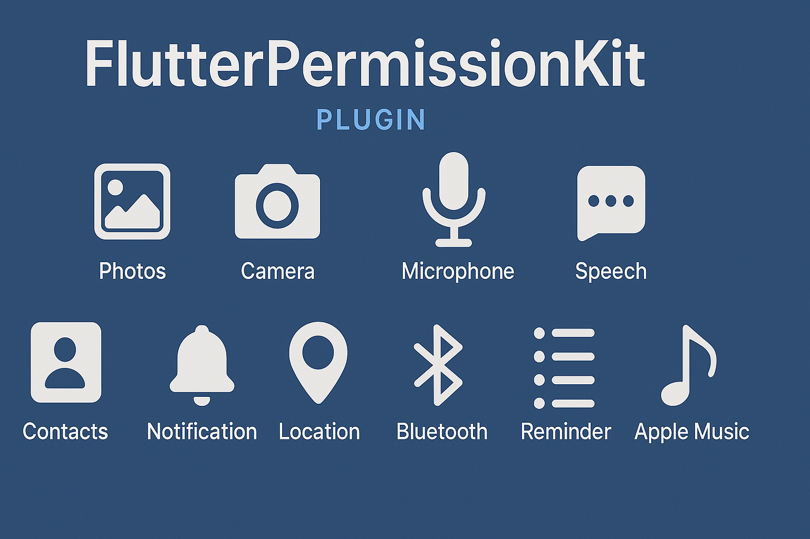
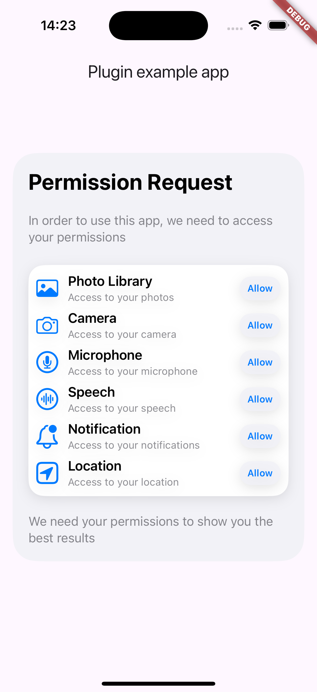
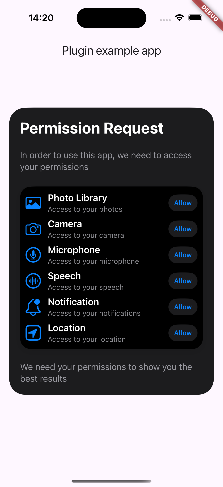
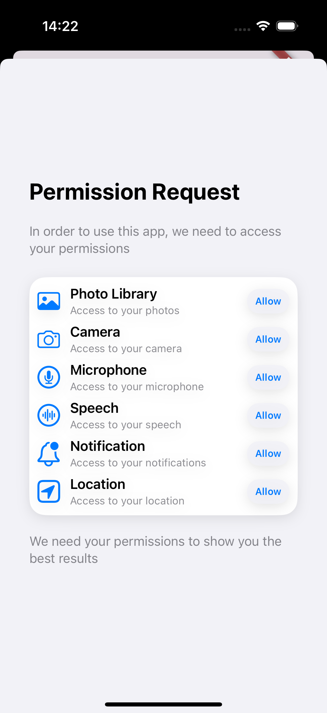
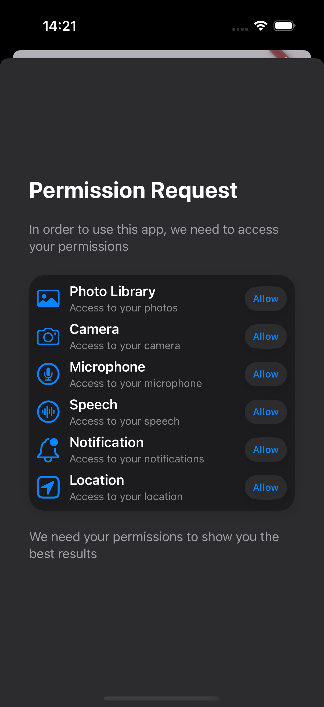

# Flutter Permission Kit

<div align="center">



**A comprehensive Flutter plugin for managing iOS system permissions with customizable UI and unified API**

[](https://pub.dev/packages/flutter_permission_kit)
[](https://github.com/maojiu-bb/flutter_permission_kit/blob/main/LICENSE)
[](https://github.com/maojiu-bb/flutter_permission_kit)

</div>

## ✨ Features

Flutter Permission Kit provides a beautiful, native iOS permission management solution with:

- 🎯 **13 iOS Permission Types**: Complete coverage of iOS system permissions
- 🎨 **Customizable UI**: Alert and Modal display modes with full customization
- 🔧 **Unified API**: Single initialization method for all permission types
- 📱 **Native iOS Design**: Seamless integration with iOS design patterns
- 🌙 **Dark Mode Support**: Automatic adaptation to system theme
- 🛡️ **Type-Safe**: Comprehensive enum definitions and error handling
- 📚 **Well Documented**: Extensive documentation and example app

## 📱 Supported Permissions

| Permission             | Description               | iOS Framework           |
| ---------------------- | ------------------------- | ----------------------- |
| **Camera**             | Photo and video capture   | AVFoundation            |
| **Photos**             | Photo library access      | Photos                  |
| **Microphone**         | Audio recording           | AVFoundation            |
| **Speech Recognition** | Voice-to-text conversion  | Speech                  |
| **Contacts**           | Address book access       | Contacts                |
| **Notifications**      | Push notifications        | UserNotifications       |
| **Location**           | GPS and location services | CoreLocation            |
| **Calendar**           | Calendar events access    | EventKit                |
| **Tracking**           | App tracking transparency | AppTrackingTransparency |
| **Reminders**          | Reminders app access      | EventKit                |
| **Bluetooth**          | Bluetooth device access   | CoreBluetooth           |
| **Apple Music**        | Music library access      | MediaPlayer             |
| **Siri**               | Siri integration          | Intents                 |

## 🎨 UI Showcase

### Alert Style (Light & Dark Mode)

<div align="center">


</div>

### Modal Style (Light & Dark Mode)

<div align="center">


</div>

## 🚀 Installation

Add this to your package's `pubspec.yaml` file:

```yaml
dependencies:
  flutter_permission_kit: ^1.0.0
```

Then run:

```bash
flutter pub get
```

## ⚙️ iOS Setup

### 1. Update Info.plist

Add the required permission descriptions to your `ios/Runner/Info.plist`:

```xml
<dict>
    <!-- Camera Permission -->
    <key>NSCameraUsageDescription</key>
    <string>We need access to your camera to take photos</string>

    <!-- Photo Library Permission -->
    <key>NSPhotoLibraryUsageDescription</key>
    <string>We need access to your photos to save your profile picture</string>
    <key>NSPhotoLibraryAddUsageDescription</key>
    <string>We need access to your photos to save your profile picture</string>

    <!-- Microphone Permission -->
    <key>NSMicrophoneUsageDescription</key>
    <string>We need access to your microphone to record your voice</string>

    <!-- Speech Recognition Permission -->
    <key>NSSpeechRecognitionUsageDescription</key>
    <string>We need access to your speech to transcribe your voice</string>

    <!-- Contacts Permission -->
    <key>NSContactsUsageDescription</key>
    <string>We need access to your contacts to find your friends</string>

    <!-- Location Permission -->
    <key>NSLocationWhenInUseUsageDescription</key>
    <string>We need access to your location to show you nearby content</string>

    <!-- Calendar Permission -->
    <key>NSCalendarsUsageDescription</key>
    <string>We need access to your calendar to schedule events</string>

    <!-- Tracking Permission -->
    <key>NSUserTrackingUsageDescription</key>
    <string>We need access to your tracking data for personalized ads</string>

    <!-- Reminders Permission -->
    <key>NSRemindersFullAccessUsageDescription</key>
    <string>We need access to your reminders to help you stay organized</string>

    <!-- Bluetooth Permission -->
    <key>NSBluetoothAlwaysUsageDescription</key>
    <string>We need access to Bluetooth to connect with nearby devices</string>

    <!-- Apple Music Permission -->
    <key>NSAppleMusicUsageDescription</key>
    <string>We need access to your Apple Music library</string>

    <!-- Siri Permission -->
    <key>NSSiriUsageDescription</key>
    <string>We need access to Siri for voice commands</string>
</dict>
```

### 2. Minimum iOS Version

#### Update Podfile

Ensure your iOS platform version is set to **iOS 15.0** in `ios/Podfile`:

```ruby
# Uncomment this line to define a global platform for your project
platform :ios, '15.0'
```

#### Update Xcode Project

Also ensure your iOS deployment target is at least **iOS 15.0** in `ios/Runner.xcodeproj/project.pbxproj`:

```
IPHONEOS_DEPLOYMENT_TARGET = 15.0;
```

## 📖 Usage

### Basic Implementation

```dart
import 'package:flutter/material.dart';
import 'package:flutter_permission_kit/flutter_permission_kit.dart';
import 'package:flutter_permission_kit/core/flutter_permission_kit_config.dart';
import 'package:flutter_permission_kit/core/permission.dart';
import 'package:flutter_permission_kit/enums/display_type.dart';
import 'package:flutter_permission_kit/enums/permission_type.dart';

class MyApp extends StatefulWidget {
  @override
  _MyAppState createState() => _MyAppState();
}

class _MyAppState extends State<MyApp> {
  @override
  void initState() {
    super.initState();
    _initializePermissions();
  }

  Future<void> _initializePermissions() async {
    final success = await FlutterPermissionKit.init(
      config: FlutterPermissionKitConfig(
        displayType: DisplayType.modal, // or DisplayType.alert
        displayTitle: 'App Permissions',
        displayHeaderDescription: 'To provide you with the best experience, we need access to:',
        displayBottomDescription: 'You can change these settings later in your device settings.',
        permissions: [
          Permission(
            name: 'Camera Access',
            description: 'Take photos and record videos',
            type: PermissionType.camera,
          ),
          Permission(
            name: 'Photo Library',
            description: 'Select photos from your gallery',
            type: PermissionType.photos,
          ),
          Permission(
            name: 'Microphone',
            description: 'Record audio for voice messages',
            type: PermissionType.microphone,
          ),
          Permission(
            name: 'Location',
            description: 'Show nearby content and places',
            type: PermissionType.location,
          ),
        ],
      ),
    );
  }

  @override
  Widget build(BuildContext context) {
    return MaterialApp(
      home: Scaffold(
        appBar: AppBar(
          title: Text('Flutter Permission Kit'),
        ),
        body: Center(
          child: Column(
            mainAxisAlignment: MainAxisAlignment.center,
            children: [
              Text('iOS Permission Management'),
              SizedBox(height: 20),
              ElevatedButton(
                onPressed: _initializePermissions,
                child: Text('Request Permissions'),
              ),
            ],
          ),
        ),
      ),
    );
  }
}
```

### Advanced Configuration

```dart
FlutterPermissionKitConfig(
  displayType: DisplayType.modal,
  displayTitle: 'Permission Request',
  displayHeaderDescription: 'We need your permission to access:',
  displayBottomDescription: 'These permissions help us provide better features.',
  permissions: [
    // Define your required permissions
  ],
)
```

## 🔍 API Reference

### FlutterPermissionKit

The main class for managing permissions.

#### Methods

##### `init({required FlutterPermissionKitConfig config})`

Initializes the permission kit with the provided configuration.

**Parameters:**

- `config`: Configuration object containing UI settings and permission list

**Returns:**

- `Future<bool>`: `true` if initialization was successful, `false` otherwise

### FlutterPermissionKitConfig

Configuration class for customizing the permission request UI.

#### Properties

| Property                   | Type               | Description                      | Default  |
| -------------------------- | ------------------ | -------------------------------- | -------- |
| `displayType`              | `DisplayType`      | UI display mode (alert/modal)    | Required |
| `displayTitle`             | `String`           | Title shown in permission dialog | Required |
| `displayHeaderDescription` | `String`           | Header description text          | Required |
| `displayBottomDescription` | `String?`          | Bottom description text          | Optional |
| `permissions`              | `List<Permission>` | List of permissions to request   | Required |

### Permission

Represents a single permission request.

#### Properties

| Property      | Type             | Description                               | Default  |
| ------------- | ---------------- | ----------------------------------------- | -------- |
| `name`        | `String?`        | Display name for the permission           | Optional |
| `description` | `String?`        | Description of why permission is needed   | Optional |
| `type`        | `PermissionType` | Type of permission (camera, photos, etc.) | Required |

### DisplayType

Enum defining the UI display modes.

```dart
enum DisplayType {
  alert,  // System alert dialog
  modal,  // Full-screen modal presentation
}
```

### PermissionType

Enum defining all supported permission types.

```dart
enum PermissionType {
  camera,
  photos,
  microphone,
  speech,
  contacts,
  notification,
  location,
  calendar,
  tracking,
  reminder,
  bluetooth,
  music,        // Apple Music
  siri,
}
```

## 🎯 Best Practices

### 1. Request Only Necessary Permissions

Only request permissions that are essential for your app's core functionality.

### 2. Provide Clear Descriptions

Use clear, user-friendly descriptions that explain why each permission is needed.

## 🔧 Troubleshooting

### Common Issues

**1. Permission dialog not showing**

- Ensure all required Info.plist keys are added
- Check that iOS deployment target is 15.0+
- Verify permission descriptions are not empty

**2. App crashes when requesting permissions**

- Make sure FlutterPermissionKit.init() is called before requesting permissions
- Check that all required frameworks are linked

## 📄 License

This project is licensed under the MIT License - see the [LICENSE](LICENSE) file for details.

## 🤝 Contributing

Contributions are welcome! Please feel free to submit a Pull Request. For major changes, please open an issue first to discuss what you would like to change.

## 📞 Support

If you have any questions, issues, or feature requests, please:

- 🐛 [Open an issue](https://github.com/maojiu-bb/flutter_permission_kit/issues)
- 💬 [Start a discussion](https://github.com/maojiu-bb/flutter_permission_kit/discussions)
- 📧 Contact the maintainer

## ⭐ Show your support

Give a ⭐️ if this project helped you!
